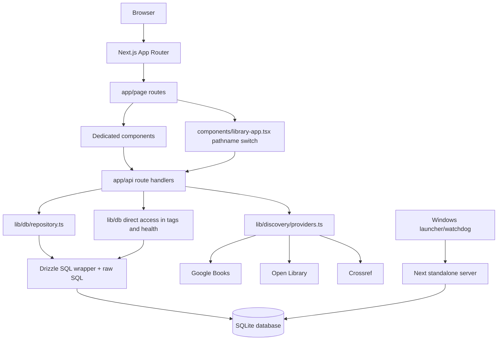

# Fangcun 0.x Baseline Report

## 0. Audit Metadata

- 审计日期：2026-09-09（Asia/Shanghai）。
- 审计对象：`200212szh-creator/fangcun`，远程仓库为 `https://github.com/200212szh-creator/fangcun`。
- 远程验证：仓库存在、可访问、公开，默认分支为 `main`（`VERIFIED`）。
- 审计分支与提交：`main` / `3b14fe6c5fafc72a010d383a6e64b65b48a9377a`（`VERIFIED`）。
- 审计范围：Fangcun 0.x 当前代码、配置、页面/API 路由、SQLite schema、迁移脚本、测试、Windows 本地运行脚本，以及升级前备份副本的只读结构与完整性检查。
- 文档来源：仓库内 `README.md`；任务附件 `FANGCUN_HANDBOOK_v1.2_Implementation_Baseline` 中的 `AGENTS.md`、`NEXT_CODEX_TASK.md` 与指定 Handbook 文件。仓库本身缺少这些任务要求的治理文件，附件版本作为本次审计的规范依据（`VERIFIED`）。
- 证据标记：`VERIFIED`=直接读取或执行得到；`INFERRED`=由已验证证据推导；`UNVERIFIED`=本次未安全执行；`BLOCKED`=因安全边界或运行配置而跳过。
- 数据边界：未打开或修改正式运行数据库；只读检查了升级前备份副本。未执行正式迁移、回滚、恢复、服务切换、提交、推送或部署。

## 1. Executive Summary

Fangcun 当前是一个可构建、可进行仓储层测试的本地优先 SQLite 应用，但还不是 Handbook v1.2 所要求的完整 `Work → Edition → Copy` 数据基础。当前代码已经有 Edition、Copy、书架、分类、标签、借阅、批注、愿望单和论文资料夹等能力；第一类域对象 `Work` 尚不存在，`research_works` 只是论文/研究记录，不能代替图书 Work（`VERIFIED`）。

代码质量基线为绿色：类型检查、lint、单元/集成测试、生产构建和隔离临时数据库验证均通过。Playwright 未执行，因为配置允许复用 `localhost:3000`，而该端口可能连接正式本地服务；E2E 会创建/修改书籍、书架、借阅和批注，无法在当前配置下证明数据隔离（`BLOCKED`）。

最新升级前备份副本包含 1 个 Edition、1 个 Copy、2 个 Shelf，所有本次检查的外键式关联孤儿计数均为 0，备份 sidecar 标记为完整且 SHA-256 匹配（`VERIFIED`）。这说明当前样本健康，但不能证明 schema 具备约束能力，也不能替代迁移前的全量 dry-run。

最重要的结论是：下一步应先锁定 Work 的标识、Edition→Work 回填规则和位置语义，再在隔离数据库副本上设计/演练 0003。不要把 Work schema、位置重构、Contributor 归一化、API 边界重写和视觉/运行时改造绑在同一个变更中。

## 2. Scope and Stop Conditions

本次遵守任务要求的只读审计边界：

- 先验证仓库、分支、提交和 Handbook 来源，再读取代码与运行材料。
- 按任务指定顺序读取 `AGENTS.md`、`README.md`、`NEXT_CODEX_TASK.md`、治理/架构/迁移/实现契约/Definition of Done 文件。
- 允许读取 schema、迁移、路由、测试、运行脚本、备份元数据和备份副本；禁止正式数据库写入、产品实现、依赖变更和配置改造。
- 不使用 reset、stash、revert、checkout 或清理操作；保留审计前已存在的 `design-system/default/references/` 未跟踪目录。
- 仅创建本报告作为审计交付物。

停止条件结果：仓库和远程均可用；正式数据库写入风险通过不运行维护/迁移命令来规避；E2E 因复用正式端口的潜在风险而停止。该停止不影响本报告对仓储层和静态代码的判断。

## 3. Repository and Toolchain Baseline

项目使用 npm，`package-lock.json` 为 lockfileVersion 3。已验证的运行时版本如下：

| 项目 | 当前值 | 证据 |
|---|---|---|
| Node.js | `v24.16.0` | `VERIFIED` |
| npm | `11.13.0` | `VERIFIED` |
| Next.js | `15.5.25` | 已安装版本/构建输出，`VERIFIED` |
| React / React DOM | `19.2.8` | 已安装版本，`VERIFIED` |
| TypeScript | `5.9.3` | 已安装版本，`VERIFIED` |
| Tailwind CSS | `3.4.19` | 已安装版本，`VERIFIED` |
| Drizzle ORM | `0.44.7` | 已安装版本，`VERIFIED` |
| better-sqlite3 | `12.11.1` | 已安装版本，`VERIFIED` |
| Vitest | `3.2.7` | 已安装版本，`VERIFIED` |
| Playwright | `1.63.0` | 已安装版本，未执行 E2E，`VERIFIED/BLOCKED` |

`package.json` 提供开发、构建、lint、typecheck、测试、数据库初始化/迁移/回滚/验证、备份/恢复和 Windows runtime release/install/backup 脚本。当前 package 仍以 `personal-library` 为包名，且没有为本次审计增加依赖（`VERIFIED`）。

## 4. Working Tree and Change Boundary

审计开始时工作区只有一项未跟踪内容：

```text
?? design-system/default/references/
```

该目录被视为用户已有内容，不读取其内容、不删除、不移动、不覆盖。审计期间未修改应用代码、样式、依赖、lockfile、数据库、runtime 配置或正式数据。报告写入后，预期新增项仅为本文件；已有的 references 目录仍应保留（`VERIFIED`）。

## 5. Runtime and Database Resolution

`lib/runtime/paths.ts` 的数据库解析逻辑是：当 `FANGCUN_DATA_DIR` 为绝对路径时使用其数据根；`DATABASE_URL` 可指定绝对或相对数据库路径；两者都未覆盖时，默认落到 `process.cwd()/data/library.db`（`VERIFIED`）。本次审计 shell 中未设置应用专用环境变量，因此测试数据库均显式隔离到临时路径或测试路径，未使用正式运行数据。

运行材料显示 Windows 正式服务通过 standalone server、watchdog、健康检查、备份和 release pointer 管理数据目录；实际当前 pointer 指向 release leaf `2026-09-08_223319`。维护说明中的示例/当前状态仍写着 `2026-09-08_160000`，存在运行文档漂移（`VERIFIED`）。

仓库内可见的本地测试/开发数据库文件包括 `data/library.db`、E2E 数据库和其 WAL/SHM 文件；本次没有对这些文件做内容写入。正式数据根、正式数据库及其备份路径均在本报告中以 `<formal-data-root>` 表示，避免把机器路径当作迁移配置复制出去。

## 6. Current Architecture



当前应用边界是“页面组件 → API route → repository/raw SQL → SQLite”，同时 discovery API 直接连接公共书目服务。专门页面组件与 `library-app.tsx` 中按 pathname 分派的旧视图并存，形成重复的页面实现与潜在 ownership 冲突（`VERIFIED`）。

## 7. Page and Route Inventory

| 路由 | 当前实现 | 观察 |
|---|---|---|
| `/` | `components/welcome-page.tsx` | 品牌入口与进入藏书室偏好 |
| `/home` | `components/home-page.tsx` | 首页统计、最近入藏、书架概览 |
| `/add` | `components/add-book-page.tsx` | 按书名、ISBN/扫描、完全手动录入 |
| `/books/[copyId]` | `components/book-detail-page.tsx` | Edition 元数据、Copy 位置、借阅、批注、保存反馈 |
| `/import` | `components/import-page.tsx` | 导入预览与提交 |
| `/manage` | `components/manage-page.tsx` | 分类、书架、标签与位置视图 |
| `/search` | `components/search-page.tsx` | 书目/论文统一检索 |
| `/settings` | `components/settings-page.tsx` | 语言、JSON/CSV 导出、入口链接 |
| `/library` | `components/library-app.tsx` 的 `LibraryView` | 旧的通用 pathname 分派视图，与 dedicated 页面重叠 |
| `/wishlist` | `components/library-app.tsx` 的 `WishlistView` | 愿望单视图 |
| `/research` | `components/library-app.tsx` 的 `ResearchView` | 论文资料夹与论文记录 |

页面与 API 路由均能在生产构建输出中找到；页面级行为没有因为安全原因执行 Playwright，因此页面 inventory 不等同于用户流完成证明。

## 8. API Inventory

| API | 方法 |
|---|---|
| `/api/catalog/books` | GET, POST |
| `/api/catalog/books/[copyId]` | GET, PATCH, DELETE |
| `/api/catalog/books/from-edition` | POST |
| `/api/catalog/metadata` | GET |
| `/api/catalog/categories` | GET, POST |
| `/api/catalog/tags` | POST |
| `/api/catalog/shelves` | GET, POST |
| `/api/catalog/shelves/[shelfId]` | PATCH, DELETE |
| `/api/catalog/wishlist` | GET, POST, DELETE |
| `/api/catalog/loans/[loanId]` | PATCH |
| `/api/catalog/books/[copyId]/loans` | GET, POST |
| `/api/catalog/annotations` | GET |
| `/api/catalog/annotations/[annotationId]` | PATCH, DELETE |
| `/api/catalog/books/[copyId]/annotations` | GET, POST |
| `/api/catalog/books/[copyId]/bookplate` | GET |
| `/api/discovery/books` | GET |
| `/api/discovery/books/[candidateId]/editions` | GET |
| `/api/discovery/isbn/[isbn]` | GET |
| `/api/discovery/related` | GET |
| `/api/discovery/search` | GET |
| `/api/export` | GET |
| `/api/import/books/preview` | POST |
| `/api/import/books/commit` | POST |
| `/api/catalog/research` | GET, POST |
| `/api/health` | GET |

路由覆盖面已超过最小可用藏书室，但缺少明确的 domain/service contract；权限、用户边界、关联约束和迁移兼容逻辑不能仅从路由存在推断为完成。

## 9. Repository, Service, and Data Access Boundary

`app/api` route handlers 主要直接导入 `lib/db/repository`；标签和健康检查还直接访问 `lib/db`。`repository.ts` 使用 `better-sqlite3`/Drizzle SQL 模板与大量 SQL 字符串，没有独立的 domain/service adapter 层（`VERIFIED`）。

当前边界的关键特征：

- `USER_ID = "local-owner"` 在 repository 和部分 route 中硬编码；这符合 1.0 单 owner 约束，但不构成可替换的认证边界。
- Copy 查询以 `owned_copies.id` 作为实体副本身份，通过 `edition_id` 连接 Edition；Edition 与 Copy 的写入路径混合在 repository 内。
- tags 只找到创建和读取路径，未找到 repository/API/UI 中完整的 `copy_tags` 赋值/移除路径；这使标签表存在但功能闭环不完整。
- `listWishlist()` 将返回对象中的 `edition.id` 映射为 wishlist 记录的 `record.id`，而不是 `edition_id`，构成已验证的返回数据 bug。
- `folder_works`、`loans`、`annotations` 的部分查询/写入依赖当前单 owner 约定，没有系统性校验关系对象属于当前 owner。

结论：迁移前需要先决定 repository/domain adapter 的 ownership，再做 Work 或 Contributor 的写路径切换；不应让每个 route 自行拼装兼容逻辑。

## 10. Actual Schema Inventory

升级前备份副本实际包含 18 张表（`VERIFIED`）：

| 表 | 主要职责 | 关键字段/观察 |
|---|---|---|
| `book_editions` | 书目/版本 | `id,title,authors,translators,isbn10,isbn13,source` 等；没有 `work_id` |
| `owned_copies` | 实体副本 | `id,user_id,edition_id,reading_status,shelf_location_id,shelf_slot,shelf_coordinate` 等 |
| `shelf_locations` | 当前书架树 | `id,name,parent_id,room,user_id,sort_order,active` |
| `categories` | 用户分类 | `user_id`，可建可列 |
| `tags` | 用户标签 | `user_id`，但缺少完整挂载闭环 |
| `copy_tags` | Copy-Tag 关联 | `copy_id,tag_id`；DDL 没有 FK |
| `wishlist_items` | 愿望单 | `edition_id,user_id` |
| `research_works` | 论文/研究记录 | `title,authors,doi,...,user_id`；不是图书 Work |
| `research_folders` | 论文资料夹 | `user_id` |
| `folder_works` | 资料夹-论文关联 | `folder_id,work_id`；这里的 work 指 research work |
| `external_references` | 外部来源引用 | `entity_type,entity_id,source,source_id,user_id` |
| `search_cache` | 检索缓存 | `cache_key,kind,payload,expires_at` |
| `loans` | 借阅记录 | `copy_id`、借阅人和状态；无 user_id |
| `concepts` | 批注概念 | `user_id` |
| `annotations` | Copy 批注 | `copy_id,page_label,body`；无 user_id |
| `annotation_concepts` | 批注-概念关联 | `annotation_id,concept_id`；DDL 没有 FK |
| `schema_migrations` | 已应用迁移 | 实际包含 `0001_archive_fields` 与 `0002_loans_annotations` |

核心结构缺口：

1. 没有一等公民 `works` 表；不能把 `research_works` 改名或复用为图书 Work。
2. `authors`、`translators` 是 JSON 文本列，不是规范化 Contributor；原始信息需要在归一化时保留。
3. Copy 身份虽清楚，但 Copy、Loan、Annotation、Join table 的约束主要依赖应用代码；DDL 未声明关系外键。
4. 位置仍是 `room` 加自由文本/slot/coordinate，没有 Handbook 要求的可演进 Room/Zone/Shelf/Level/可选 Slot 语义和 canonical code。
5. `reading_status` 的代码/验证允许 `dropped`，而 Handbook 锁定枚举为 `unread/reading/read/paused`，存在已验证不一致。

## 11. Migration Inventory

实际 `schema_migrations` 行为如下（`VERIFIED`）：

```text
0001_archive_fields  2026-09-08T00:11:32.608Z
0002_loans_annotations  2026-09-08T00:33:18.249Z
```

- `migrations/0001_archive_fields.up.sql` 添加购藏、价格、品相、位置坐标等字段和索引。
- `migrations/0002_loans_annotations.up.sql` 添加 loans、concepts、annotations 及关联表和索引。
- `scripts/migrate.ts` 和 `scripts/migrate-v2.ts` 会创建 `schema_migrations` 并按 id 记录迁移。
- `scripts/rollback-migration.ts` 具备针对 0002/0001 的回退路径，但本次没有执行。
- `scripts/validate-migration.ts` 只验证 0001 字段以及 editions/copies/shelves 数量，未验证 migration history、FK、孤儿关系或 Work 边界。
- 更早进入应用的 `ensureDatabase()` 直接执行当前 schema 的 `CREATE TABLE IF NOT EXISTS`。它不创建 `schema_migrations`，因此新库或旧库可能在没有完整迁移历史的情况下看起来“结构正确”。这是 schema truth 与 migration truth 分裂的主要风险。

0003 及以后只能采用增量、可检测、可回滚的 ADD → BACKFILL → COMPATIBILITY/DUAL READ → VALIDATE → SWITCH WRITE PATH → OBSERVE → CLEANUP LATER 流程；本次没有实现或运行任何新迁移。

## 12. Data Integrity and Ownership Findings

本次只读检查的对象是升级前备份副本，sidecar 的 `integrity` 为 `ok`，其 SHA-256 与实际文件匹配；只读 `PRAGMA integrity_check` 返回 `ok`，连接层 `foreign_keys` 值为 1（`VERIFIED`）。

备份副本行数：

| 表 | 行数 |
|---|---:|
| `book_editions` | 1 |
| `owned_copies` | 1 |
| `shelf_locations` | 2 |
| 其他 15 张表 | 0 |

只读孤儿关系检查：

| 检查 | 数量 |
|---|---:|
| Copy 缺 Edition | 0 |
| Copy 缺 Shelf | 0 |
| Copy 缺 Category | 0 |
| `copy_tags` 缺 Copy / Tag | 0 / 0 |
| Loan 缺 Copy | 0 |
| Annotation 缺 Copy | 0 |
| AnnotationConcept 缺 Annotation / Concept | 0 / 0 |
| Wishlist 缺 Edition | 0 |
| FolderWork 缺 Folder / ResearchWork | 0 / 0 |

这些 0 只说明当前备份样本没有发现孤儿，不表示数据库具备 FK 保护。所有者范围也不完整：`book_editions`、`loans`、`annotations` 及部分 join 表没有 `user_id`；当前 `local-owner` 约束属于应用层约定（`VERIFIED`）。

## 13. Discovery and Search Findings

书目 discovery 由 Google Books、Open Library、Crossref 组成；Google/Open Library 并行搜索，结果按标题相似度和来源排序，并在外部服务不可用时回退本地数据。已验证的超时大致为 Google 3500ms、Open Library 5000ms、Crossref 5000ms；Google 429 有 5 分钟 cooldown，搜索缓存约 24 小时，精确结果缓存约 30 天（`VERIFIED`）。

该实现能支撑“先找到版本，再放入书架”的当前流程，但本次未执行外部网络请求或浏览器搜索，因此以下内容保持未验证：实际公共 API 可用性、返回质量、不同语言标题命中、ISBN 版本去重和慢请求体验。搜索结果质量不能用当前绿色的 typecheck/build 代替。

## 14. Product Flow Inventory

`WORKING/TESTED` 仅表示当前测试覆盖的 repository slice；不是 UI 或完整端到端完成证明。

| 流程 | 状态 | 证据与边界 |
|---|---|---|
| Home | `PRESENT BUT UNVERIFIED` | 页面与 API 调用存在；未安全执行浏览器流 |
| Collection | `PRESENT BUT UNVERIFIED` | 列表、搜索、筛选、网格/列表、软删除路径存在 |
| Book Detail | `PRESENT BUT UNVERIFIED` | dedicated 页面与 API 存在；保存反馈代码存在 |
| Quick Edit | `PARTIAL` | Detail 内有编辑能力，但没有独立、清晰的 quick-edit contract，且旧视图重复 |
| Add Book | `PRESENT BUT UNVERIFIED` | 书名、ISBN/扫描、完全手动录入代码存在 |
| ISBN lookup/scanner | `PRESENT BUT UNVERIFIED` | providers 与 UI 存在；未验证外部服务及扫描环境 |
| Unified Search | `PRESENT BUT UNVERIFIED` | 书目/论文 API 与 UI 存在；未验证外部结果和延迟 |
| Location | `WORKING/TESTED` | repository 级 shelf CRUD、停用/在用保护有集成测试；完整 UI 流未验证 |
| Loans | `WORKING/TESTED` | repository 级借出、归还、续借有集成测试；UI/API 流未验证 |
| Annotations/concepts | `WORKING/TESTED` | repository 级批注和概念关联有集成测试；UI 流未验证 |
| Relations/concepts | `PARTIAL` | related endpoint 与批注概念存在；没有一等公民关系模型与完整 UI |
| Wishlist | `PRESENT BUT UNVERIFIED` | API、repository、视图存在；返回 Edition id 有已验证映射 bug |
| Research folders/papers | `PRESENT BUT UNVERIFIED` | 论文与资料夹存在；与图书 Work 分离 |
| Import/Export | `PRESENT BUT UNVERIFIED` | JSON/CSV 导出与导入 preview/commit 存在；未实测备份兼容性 |
| Settings | `PRESENT BUT UNVERIFIED` | 语言和导出存在；没有完整备份/恢复 UI |
| Backup/Restore | `PRESENT BUT UNVERIFIED` | scripts 与备份产物存在；未做恢复 rehearsal |
| Windows runtime | `PRESENT BUT UNVERIFIED` | launcher/watchdog/release 代码存在；未操作正式服务 |
| E2E suite | `BLOCKED` | 复用 3000 端口的配置可能触达正式服务并写入数据 |

## 15. Quality Baseline

| 检查 | 是否存在/执行 | 结果 |
|---|---|---|
| `npm run typecheck` | 存在，已执行 | PASS，exit 0 |
| `npm run lint` | 存在，已执行 | PASS，exit 0 |
| `npm test -- --reporter=verbose` | 存在，已执行 | PASS，2 个测试文件、8 个测试通过 |
| `npm run build` | 存在，已执行 | PASS；Next 15.5.25 编译并生成页面/API 路由 |
| `npm run db:validate` | 存在，已执行 | PASS；指向唯一临时数据库，`valid:true`，editions/copies/shelves 均为 0 |
| Playwright | 配置存在，未执行 | `BLOCKED`，见第 16 节 |
| 升级前备份副本完整性 | 存在，已只读检查 | PASS；sidecar、SHA-256、SQLite integrity_check 一致 |

`npm test` 的集成测试使用隔离测试数据库，并在测试前后处理该隔离文件；本次没有把测试配置改向正式数据。

## 16. Playwright and Runtime Verification Limits

`playwright.config.ts` 的 `webServer` 使用 `npm run dev`、`http://localhost:3000` 和 `reuseExistingServer: true`，并设置 E2E 数据库路径。但当前端口可能已有正式服务，复用后测试请求可能落到正式实例；E2E 测试本身会创建书架、书籍、借阅和批注，因此即使测试数据路径看似隔离，也不能在复用服务下视为安全（`VERIFIED`）。

其他 motion/feedback/phase7 配置面向 3017，但没有独立 `webServer`，当前审计未启动或切换服务来满足它们。结论是 E2E 为 `BLOCKED`，原因是数据安全与服务隔离不足，不是把测试结果误报为失败。

Windows runtime 也只做了源代码、pointer 和备份元数据检查；没有启动、停止、重启、提升 release、执行维护或恢复数据库，以避免外部状态变化。

## 17. Backup, Restore, and Formal DB Safety

升级前备份目录已有 9 份 `.db.json` sidecar；最新副本的完整性标记为 `ok`，SHA-256 已重新计算并匹配，备份副本只读 `integrity_check` 为 `ok`（`VERIFIED`）。这为后续隔离 dry-run 提供了起点，但没有完成恢复演练。

需要特别标记的运行时风险：`runtime/maintenance/database-maintenance.js` 以 `{readonly:false}` 打开数据库并执行 WAL checkpoint；它不是只读诊断脚本。正式运行服务使用的数据库路径应始终由明确的备份、确认和维护窗口保护，本次没有调用它。

`runtime/maintenance/restore-database.js` 要求 `--confirm`，并先验证临时副本、再将目标移入 recovery 后原子替换；本次没有运行恢复。正式数据库没有被打开、checkpoint、迁移或覆盖。

## 18. Current-State Gaps vs Handbook v1.2

| CURRENT | TARGET | STATUS | MIGRATION RISK | DEPENDENCIES | DO NOT DO YET |
|---|---|---|---|---|---|
| Edition 直接承载书目，没有图书 `Work` | 一等公民 `Work → Edition → Copy` | `MISSING` | 高；错误合并会破坏版本语义 | Work 主键、Edition→Work 规则、重复合并策略 | 不要直接合并 Edition、改写现有 Copy 归属 |
| `ensureDatabase()` 可直接补齐表结构，迁移历史另存 | 可检测、可审计、可回滚的版本化 schema | `PARTIAL` | 高；可能跳过历史或误判已迁移 | migration runner 单一真相、备份和 dry-run | 不要在正式库运行新 SQL 试探 |
| `shelf_locations.room` + 自由文本/slot/coordinate | Room/Zone/Shelf/Level/可选 Slot + canonical code | `PARTIAL` | 高；名称猜测会导致位置错位 | 位置语义、默认 level/slot 决策、兼容读取 | 不要按书架名称推断层级 |
| `authors`/`translators` JSON 字符串 | Contributor 实体与 Edition 关联，同时保留 raw 字段 | `PARTIAL` | 中高；丢失译者/原始排序 | Contributor 模型、解析规则、双读策略 | 不要删除或覆盖 raw author/translator |
| `local-owner` 硬编码，关系表 owner 不完整 | 明确的 owner scope，未来可接 Auth | `PARTIAL` | 高；共享/多用户阶段会串数据 | adapter、owner 传递、关系校验 | 不要现在引入真实 Auth/cloud |
| `reading_status` 允许 `dropped` | 锁定的 `unread/reading/read/paused` | `PARTIAL` | 中；枚举迁移会影响用户值 | Handbook 决策、兼容映射和 UI | 不要静默删除或重命名现有状态 |
| 标签可建/读，缺少 Copy-Tag 完整写入闭环 | Tag assignment/remove 可验证且可迁移 | `PARTIAL` | 中 | API contract、owner/FK 检查 | 不要把标签表重建成另一种模型 |
| 论文 `research_works` 与图书域分开 | 研究域保持独立，图书域引入 Work | `WORKING/TESTED` | 中 | 明确命名，避免 `work` 歧义 | 不要复用 `research_works` 承载图书 Work |
| 备份/恢复脚本存在，未完成演练 | 有证据的 backup → dry-run → restore rehearsal | `PRESENT BUT UNVERIFIED` | 高 | 独立副本、恢复验收、运行窗口 | 不要把正式恢复当作测试 |
| dedicated 页面与 `library-app.tsx` 旧分派并存 | 单一页面 ownership 与可追踪 API 边界 | `PARTIAL` | 中 | 迁移后再做 ownership 清理 | 不要与 schema migration 同时重写 UI |

## 19. Major Risks and Open Decisions

### 19.1 Three major verified risks

1. **迁移真相分裂**（`VERIFIED`）：`ensureDatabase()` 直接建表，而 `schema_migrations` 只由自定义脚本维护。新库可能没有历史记录却已经具备当前字段，导致 0003 的前置条件判断不可靠。
2. **Work、FK 与 owner 边界缺失**（`VERIFIED`）：没有图书 `works`；DDL 没有关系 FK；Loan/Annotation/部分 join 表缺 owner scope。当前样本无孤儿不代表未来写入受到约束。
3. **运行/测试可能越过数据边界**（`VERIFIED`）：E2E 复用 3000 端口，可能连接正式服务；数据库维护脚本使用可写连接并执行 WAL checkpoint。两者都必须在隔离和确认条件下操作。

### 19.2 Open decisions blocking the next migration

- **K-01 Work identity**：Work 的稳定 key、Edition→Work 是否默认一对一、何时允许人工合并。Handbook 给出“默认每个 Edition 一个 Work、未知不合并”的方向，但最终字段和 UI/审核机制仍需锁定。
- **K-02 Location semantics**：旧 `room`、parent tree、slot/coordinate 如何映射到 Room/Zone/Shelf/Level/Slot；默认 level/slot 是否为空、如何生成 canonical code。
- **K-03 Contributor compatibility**：作者/译者顺序、角色、同名处理和 raw JSON 保留策略。
- **K-04 Copy vocabulary**：`dropped` 是否兼容保留、condition 枚举、读书状态在 UI 中的最终表达。
- **K-05 Write boundary**：repository/domain adapter 是否先行，哪一个 API 是 Work/Edition/Copy 的单一写入口，如何实现 dual read/write。
- **K-06 Media storage**：封面图片继续使用 URL、缓存还是本地资产；这会影响备份与迁移，但不应混入 0003。
- **K-07 Auth/sharing stage**：1.0 继续单 owner；真实 Auth、云同步和共享延期到哪个明确阶段。

## 20. Proposed Migration 0003+

以下是提案，不是已执行变更。每一项都必须经过统一流程：**ADD → BACKFILL → COMPATIBILITY/DUAL READ → VALIDATE → SWITCH WRITE PATH → OBSERVE → CLEANUP LATER**。

### 0003 — Introduce book Work

| 阶段 | 提案 |
|---|---|
| ADD | 新增 `works`；给 `book_editions` 增加可空 `work_id` 与索引；保留全部现有 Edition/raw 字段 |
| BACKFILL | 默认每个现存 Edition 创建一个 Work，并建立 Edition→Work；不根据标题/作者猜测合并 |
| COMPATIBILITY/DUAL READ | 读取时优先 Work，再回退旧 Edition；旧导入/导出仍能读 raw Edition |
| VALIDATE | 比对 Work、Edition、Copy 数量；检查缺失 Work、重复映射、孤儿 Copy、备份可还原性 |
| SWITCH WRITE PATH | 新书目写入先建立/取得 Work，再写 Edition，再写 Copy；只在隔离副本验证后切换 |
| OBSERVE | 记录迁移计数、未决映射、API 错误、导入/导出差异 |
| CLEANUP LATER | 不删除旧字段、不做自动合并；等观察期和人工审核后再讨论约束/清理 |

### 0004 — Add typed location semantics

| 阶段 | 提案 |
|---|---|
| ADD | 为位置增加类型、canonical code、排序/层级等可空字段；保留 `room`、`shelf_slot`、`shelf_coordinate` 兼容字段 |
| BACKFILL | 只按已有 parent 关系和明确人工映射回填；不从自然语言名称猜 level/slot |
| COMPATIBILITY/DUAL READ | 新读取优先 typed fields，旧记录仍可由 legacy 字段展示 |
| VALIDATE | 检查 code 唯一性、parent 层级、Copy 所指位置、停用书架和书架保护规则 |
| SWITCH WRITE PATH | 位置新建/编辑写 typed fields，同时按兼容策略维护 legacy projection |
| OBSERVE | 观察位置查询、书架图、导入导出和移动 Copy 的差异 |
| CLEANUP LATER | 观察期后再决定是否收紧字段或移除 legacy free text |

### 0005 — Normalize contributors with raw compatibility

| 阶段 | 提案 |
|---|---|
| ADD | 新增 Contributor 及 Edition-Contributor 关系；不删除 `authors`/`translators` raw JSON |
| BACKFILL | 仅按可解析、可追溯的 raw 值生成记录，保留顺序和角色来源 |
| COMPATIBILITY/DUAL READ | 读取提供规范化 Contributor，并保留 raw fallback；导出同时保留兼容字段 |
| VALIDATE | 比对作者/译者数量、顺序、空值、原始文本和版本重复情况 |
| SWITCH WRITE PATH | 新增/编辑通过 adapter 写关系表与 raw projection |
| OBSERVE | 观察检索、详情、导入导出和跨版本显示差异 |
| CLEANUP LATER | 不在 0005 删除 raw 字段；只有在数据审计完成后再提出清理 |

### 0006 — Establish domain adapter and ownership checks

这不是必须改变 schema 的单次大重构，而是为后续写路径建立稳定边界：

- ADD：增加明确的 Work/Edition/Copy repository/domain adapter contract，统一 owner 传递、关联检查和错误分类。
- BACKFILL：为现有 route 建立只读兼容调用，记录直接 SQL 的调用点。
- COMPATIBILITY/DUAL READ：先双读并比较结果，不改变页面视觉和外部 API 形状。
- VALIDATE：对每个写入口验证 owner、Copy→Edition、Loan/Annotation/Join 关联和软删除规则。
- SWITCH WRITE PATH：按 route 分批切换到 adapter，保留旧读路径作为回退。
- OBSERVE：记录差异、失败写入、导入/导出变化和性能。
- CLEANUP LATER：确认稳定后再移除重复调用与旧 `library-app` ownership；不要和 0003/0004 同窗上线。

## 21. Recommended Task 002

推荐 Task 002 为：**Work 层设计确认与 0003 隔离数据库 dry-run 方案**。

前置条件：先由产品/数据负责人确认 K-01，至少明确 Work key、默认一对一回填、未知不合并、人工合并是否延期；同时确认 K-02 的位置策略不会被 0003 偷渡进来。

建议交付范围：

- 从已验证的升级前备份复制出独立 dry-run 数据库，不触碰正式库。
- 设计 0003 的 up/down/detection 方案，包含 `works`、可空 `book_editions.work_id`、索引和迁移记录。
- 在副本执行 ADD 与 BACKFILL，输出 Work/Edition/Copy 数量、缺失映射、重复映射、孤儿关系和 checksum。
- 验证旧 API/导入导出仍能读取；仅在副本上比较 dual-read 结果，不切换正式写入。
- 演练 rollback 或恢复到迁移前副本，记录命令、输出和耗时。
- 形成审批包：迁移文件、dry-run 报告、差异清单、回滚证明、未决问题和正式执行前 DoD。

Task 002 不应包括视觉重构、字体决策、认证/cloud、位置语义迁移、Contributor 全量归一化、正式数据库迁移或 release promotion。

## Appendix A — Commands Executed

以下为本次审计实际使用的主要检查；所有数据库探针均针对临时库或升级前备份副本，并以只读方式执行。

| 检查 | 结果 |
|---|---|
| `git remote -v`, `git branch --show-current`, `git rev-parse HEAD`, `git log -1` | 远程为目标 GitHub 仓库；分支 `main`；HEAD 为 `3b14fe6...` |
| `gh repo view 200212szh-creator/fangcun --json nameWithOwner,defaultBranchRef,visibility,url` | 公开仓库、默认分支 `main` |
| `rg --files` 与指定治理/架构/迁移文件读取 | 完成；仓库缺失的 Handbook 文件来自任务附件 |
| `node --version`, `npm --version` | Node `v24.16.0`、npm `11.13.0` |
| `npm run typecheck` | PASS，exit 0 |
| `npm run lint` | PASS，exit 0 |
| `npm test -- --reporter=verbose` | PASS，2 files / 8 tests |
| `npm run build` | PASS，Next production build 完成 |
| `npm run db:validate`（临时 `DATABASE_URL`） | PASS，`valid:true` |
| better-sqlite3 只读 backup probe | 表、migration、计数、孤儿关系、integrity_check 完成 |
| `git status --short`（审计开始前） | 仅发现已有 `design-system/default/references/` |
| Playwright | 未执行，`BLOCKED`：复用 3000 端口可能触达正式服务 |

一次只读孤儿检查的首次 shell 调用因 PowerShell 引号解析失败，未打开数据库；随后使用等价安全参数成功执行，结果见第 12 节。

## Appendix B — Relevant Evidence

- `README.md`：项目定位、运行方式和本地优先背景。
- `lib/db/schema.ts:3-73`：Drizzle 表定义、JSON 作者/译者、Copy 位置字段、research 表、Join table。
- `lib/db/index.ts:15-32`：`ensureDatabase()` 的直接 `CREATE TABLE IF NOT EXISTS`，以及未包含 `schema_migrations` 的当前表创建路径。
- `lib/db/repository.ts:6,9-98`：硬编码 `local-owner`、Copy/Edition 读写、书架保护、标签读取、wishlist id 映射、research 关系。
- `lib/types.ts:2-16`、`lib/validations.ts:28,86`：`dropped` 状态与当前类型/验证枚举。
- `scripts/migrate.ts:22-36`、`scripts/migrate-v2.ts:6-15`：迁移历史表与 0001/0002 注册路径。
- `scripts/validate-migration.ts:3-14`：当前验证范围及其未覆盖的关系/历史检查。
- `scripts/rollback-migration.ts:4-34`：已有回滚路径；本次未执行。
- `lib/runtime/paths.ts:7-24`：运行数据根和 `DATABASE_URL` 解析规则。
- `runtime/maintenance/database-maintenance.js:26-30,44-47`：可写数据库连接与 WAL checkpoint 风险证据。
- `runtime/maintenance/restore-database.js`：带确认的校验、recovery 和原子恢复路径；本次未执行。
- `playwright.config.ts:7`：3000 端口、E2E 数据库环境和 `reuseExistingServer` 风险。
- `components/home-page.tsx`、`components/add-book-page.tsx`、`components/book-detail-page.tsx`、`components/manage-page.tsx`、`components/search-page.tsx`、`components/settings-page.tsx`：dedicated 页面实现。
- `components/library-app.tsx`：旧的多 pathname view 分派，与 dedicated 页面并存。
- `lib/discovery/providers.ts`：Google Books、Open Library、Crossref、超时、缓存和 fallback。
- `docs/运行维护说明.md`、`docs/正式运行与常驻本地部署方案.md`：Windows runtime、数据根、备份/恢复与文档漂移证据。
- 升级前备份副本：`<formal-data-root>/backups/pre-upgrade/fangcun-pre-upgrade-2026-09-08T14-41-04-206Z.db` 及其 sidecar；仅只读检查，未修改正式库。
